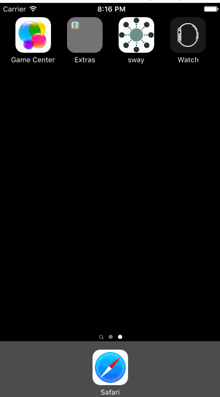
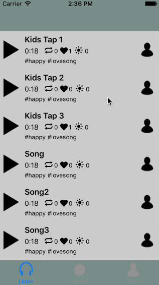
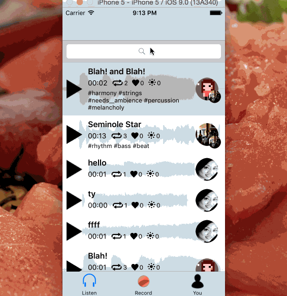

#Sway

## Description
An app for capturing, sharing, and collaborating on musical ideas.

## User Stories

## Required

### Compositions List
* [x] The user is presented with a list of compositions. Each item in the list includes the name of the composition's originator, the title, the running time, and possibly other information, such as the number of collaborators, favorites count. 
	* [x] The user can select any single item in the list to go to the **Composition Details** page
	* [x] The user can pull to refresh
	* [x] The user can play/preview any composition from this page 

### Record New Composition
* [x] A large, red Record button is shown to the user, which toggles recording on/off

	* [x] **New Recording** - The user can record audio via the microphone (the user will be reminded to use headphones)
	* [x] **Share** - The user can Share their recorded audio which publishes the audio, making it available for others to listen and collaborate on. The composition will then appear in the home feed.

### Collaborate on Existing Composition
* [x] Collaborate using an existing audio composition as a backing track. The new collaboration will include all previous parts mixed together as a single audio source.
 	* [x] **New Collaboration** - The user can load a published compostion from another user and create a new bounced (combined) composition.
 	* [x] The user can join the collaboration, which will open the **Record Composition** page with the composition's audio imported as the **Backing Track**

## Optional

### Compositions List
* [x] The user can filter the list by tags without leaving the screen
* [x] Click on any avatar, which will open that user's **User Profile** page

### Composition Details
* [x] Detailed information about the composition is shown, including all summary information, tags, favorites count, creation date, and a list of collaborators and a brief description about their contribution (could just be a series of tags)
* [x] The user can:
     * [x] Play the composition
     * [ ] Scrub the composition - Move the player cursor to a specific point to listen (optional) 
     * [x] Like the composition
     * [ ] Comment on the composition

### Record New Composition/Collaborate on Existing Composition
* [x] **Save as Draft** - The user can save recorded audio as a Draft
* [x] **Load from Draft** - The user can load an existing composition from their own profile or their drafts to create a new composition. 
* [x] **Record Options** - The user can select a backing track as a simple audio template, which is meant as a guide to get started. It will not be mixed into the final audio. (optional)

### General
* [ ] Be able to scrub recordings
* [ ] Be able to mix using sliders to change volume levels
* [x] Tags

### User Profile
* [x] Details about the user
	* [x] Header: avatar, bio and links and other data 
	* [x] Body: a **Compositions List** including all the user's compositions in reverse chronological order 
      * [ ] If the user displayed is also the account owner, controls for editing the profile content will be available

## Bonus

### Compositions List
* [ ] Recommend tags like "most popular tags" before going to a list

### User Profile
* [ ] If user hasn't published/have drafts yet, prompt a record button.
* [ ] Follow a user
* [ ] Upload your own profile pictures

### Settings
* [ ] Settings to control the app behavior
* [ ] Connectivity options (Facebook, Dropbox)

### Notifications
* [ ] Notifications menu with what user's followers upload, if users collaborate on your tune...

## Credits
Thanks to icons from the Noun Project: Edward Boatman, useiconic.com, Kirill Ulitin, & Pantelis Gkavos

## Walkthrough 

### Previous walkthroughs iterations: 

